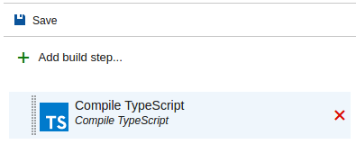
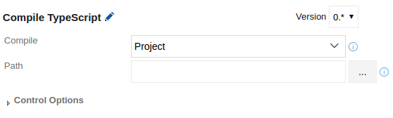
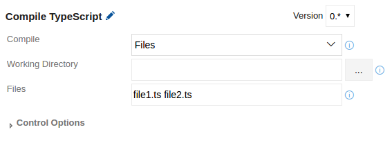

# Compile TypeScript
Compile TypeScript projects and files. No more need to locally compile .ts files.

This build task always runs the latest version of TypeScript. No need to install or maintain TypeScript on the build agent.

## Note
Make sure to have all your code dependencies in place by running eg. <code>npm install</code>.

## Usage
Add a new **Compile TypeScript** task from the **Build** category...

...and configure it as needed.

Parameters include:
* **Compile**: Choose whether to compile a project (defined in a tsconfig.json file) or files.
* **Path**: Path to a valid <code>tsconfig.json</code> file or directory containing the <code>tsconfig.json</code> file. Variables can be used. Leaving it blank defaults to source root directory and is equal to using <code>$(Build.SourcesDirectory)</code>.
* **Working Directory**: Root directory that contains .ts files to compile. Variables can be used. Leaving it blank defaults to source root directory and is equal to using <code>$(Build.SourcesDirectory)</code>.
* **Files**: Files to compile separated by space character (' '). Relative paths to files in subfolders is supported. Variables can be used.

## Having Problems?
Please [create an issue on our Github](https://github.com/BoolBySigma/CompileTypeScript/issues) and we will try to help you.
